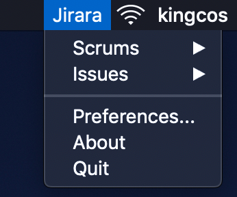
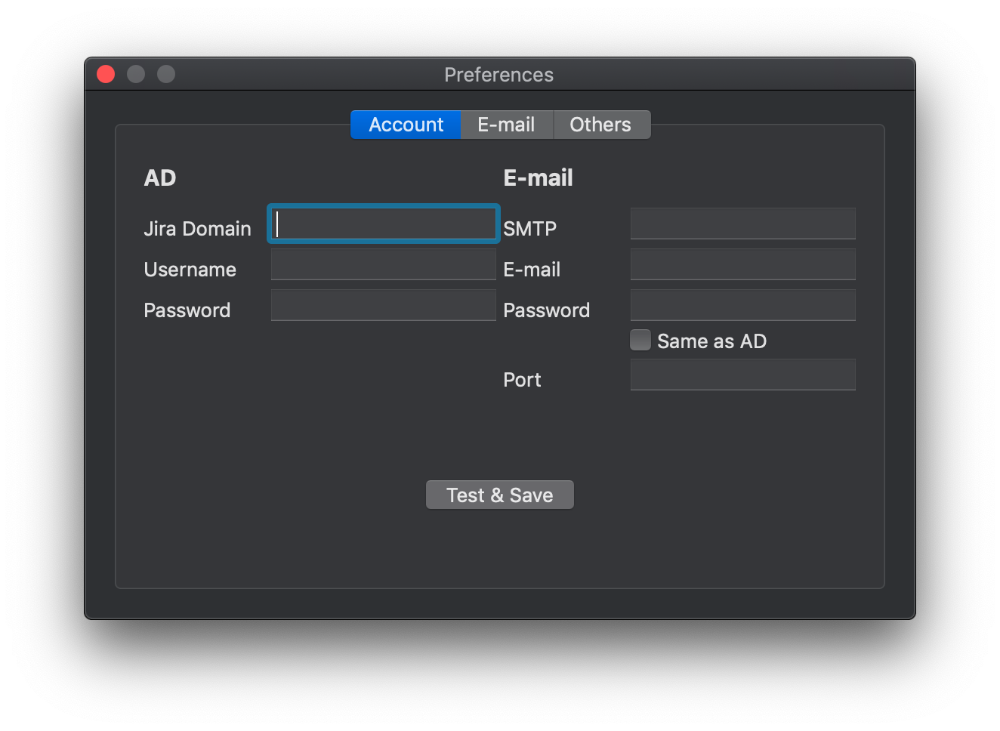

# Jirara

 

A tiny helper for Jira in your macOS menu bar.

**Status:** ***Basic functions has been released, icon & UI maybe update in the future. The master branch code is writing with RxSwift & MVVM.***

> **Attension**
> 
> This app has **only** been tested on Jira v7.1.9 & v7.12.3.

## Setup

- Download from [release page](https://github.com/kingcos/Jirara/releases).
- Move Jirara to your applications folder.
- Open it (maybe you need to allow to open it from your「 - System Preferences - Security & Privacy - General」).
- Find Jirara in menu bar.
- Setup in「Preferences...」.

## Build

- Download this repository (Download ZIP or git clone as you like)
- `pod install`
- `xed .`, then enjoy it!

## LICENSE

- MIT
